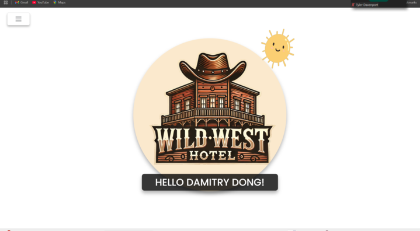
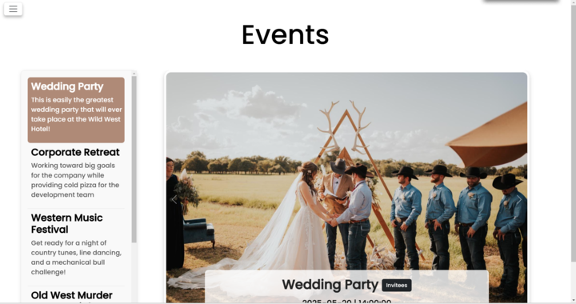
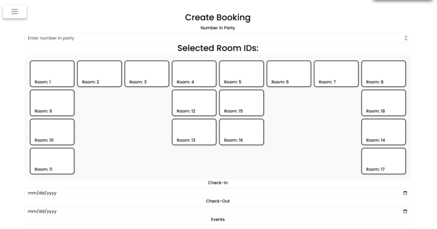
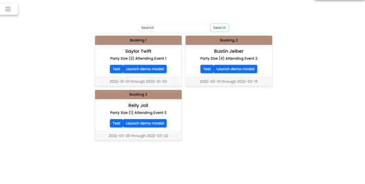

## Hotel Motel Holiday Inn :love_hotel:
This app is a FE and BE application for managing bookings at the hotel.  The user is able to view, create, edit and delete bookings.

### BE Setup
1. Clone the template repository.
2. Navigate to the created directory using `cd`.
3. Activate the Pipenv environment with `pipenv shell`.
4. Install the dependencies using `pipenv install`.
5. pipenv install django=='4.1.3' autopep8=='2.0.0' pylint=='2.15.5' djangorestframework=='3.14.0' django-cors-headers=='3.13.0' pylint-django=='2.5.3'
6. Open the project in Visual Studio Code.
7. Select interpreter-press control shift P on windows and select the correct interpreter or shift P on Mac
 Implement the code.

### Features
User Authentication is used for the user to be able to manage their own bookings. The user can manage bookings and customer relationships showing a many to one relationship. The user can manage bookings and events relationships that are managed through a many-many relationship. The user has full CRUD (create, read, update, delete operations) on bookings and customers.

### ERD
https://dbdiagram.io/d/678bdd886b7fa355c34c6c15

### Loom Video Walk Through

### Deployed

### Screenshots

### API Documents
https://documenter.getpostman.com/view/33852852/2sAYX3qi96

### Tech Stack
Python
Django

### Contributors
https://github.com/BrooksMWest
https://github.com/mkcarter7
https://github.com/DamitryDong
https://github.com/Tyler-Davenport
